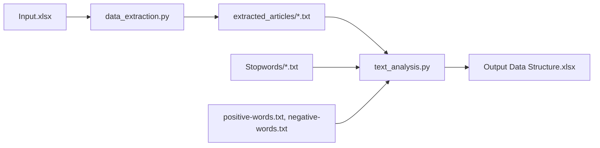
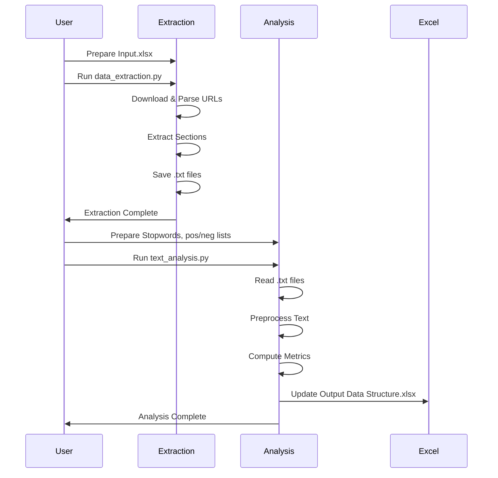

# 📰 Data Extraction and Text Analysis Documentation

This documentation covers two Python modules: **data_extraction.py** and **text_analysis.py**. Together, these scripts automate the process of **extracting structured 
text from web articles** and **analyzing the text for sentiment and readability**. The workflow is designed primarily for articles listed in an input Excel file and 
produces analytical results in an output Excel file.

---

## 📄 data_extraction.py
This script **extracts content from a list of URLs** (provided in an Excel file), **parses the webpage**, and **writes structured summaries to text files**. It is
designed for structured reports or case studies with consistent section headers.

### Key Features
- Reads URLs and IDs from an Excel file (`Input.xlsx`)
- Fetches article content using HTTP requests
- Extracts specific sections based on headers (e.g., "The Problem", "Our Solution")
- Saves extracted content as `.txt` files, named by their `URL_ID`
- Logs each step and handles errors gracefully

### Workflow Overview

```mermaid
flowchart TD
    A[Read Input.xlsx] --> B[Iterate Over Rows (URL_ID, URL)]
    B --> C[Fetch URL Content via requests]
    C --> D[Parse HTML with BeautifulSoup]
    D --> E[Extract Structured Sections]
    E --> F[Save Sectioned Text to output_dir/URL_ID.txt]
    F --> G[Next Row/URL]
```

#### Processing Steps

- **Read Input**: Loads Excel file with `URL_ID` and `URL`.
- **Fetch Content**: Uses `requests` to download the web page.
- **HTML Parsing**: Uses `BeautifulSoup` to find specific headings and extract paragraphs under them.
- **Structured Extraction**: Pulls out these sections (if present):
  - "The Problem"
  - "Project Objective"
  - "Project Description"
  - "Our Solution"
  - "Project Deliverables"
  - "Client Background"
  - "Deliverables"
  - "Tech Stack"
- **Content Assembly**: Each section is added with a label, and only relevant paragraphs are included.
- **File Output**: Results are written to a text file named `<URL_ID>.txt` in the `extracted_articles` folder.


### Example Code Snippet

```python
for index, row in df.iterrows():
    url_id = row['URL_ID']
    url = row['URL']
    response = requests.get(url)
    soup = BeautifulSoup(response.text, 'html.parser')
    # ... extract sections ...
    filepath = os.path.join(output_dir, f"{url_id}.txt")
    with open(filepath, 'w', encoding='utf-8') as file:
        file.write(article_content)
```

### Output Example

**extracted_articles/1234.txt**
```
THE PROBLEM:
<extracted paragraphs>

Project Objective:
<extracted paragraphs>

...
```

---

#### Section Extraction Table

| Section Header         | Extraction Method                        | Output Section Label         |
|-----------------------|------------------------------------------|-----------------------------|
| The Problem           | `soup.find('h1', string='The Problem')`  | THE PROBLEM:                |
| Project Objective     | `soup.find('h1', string='Project Objective')` | Project Objective:      |
| Project Description   | `soup.find('h1', string='Project Description')` | Project Description:  |
| Our Solution          | `soup.find('h1', string='Our Solution')` | OUR SOLUTION:               |
| Project Deliverables  | `soup.find('h1', string='Project Deliverables')` | OUR SOLUTION:*         |
| Client Background     | `for p in soup.find_all('p')` with keyword matching | CLIENT BACKGROUND:    |
| Deliverables          | `soup.find('h1', string='Deliverables')` | DELIVERABLES:               |
| Tech Stack            | `soup.find(class_='wp-block-list')`      | TECH STACK:                  |

> *Note: Project Deliverables appends to the "OUR SOLUTION" section due to a likely oversight—could be improved for clarity.*

---

### Error Handling

- If a section is missing, it is skipped.
- Any request or parsing error is caught and logged, and the script continues with the next article.

---

## 🧠 text_analysis.py
This script **analyzes the previously extracted text files**. It computes metrics such as **sentiment polarity, subjectivity, readability (Fog Index), and more**, and 
writes the results into an output Excel file.

### Key Features

- Reads all `.txt` files from a specified directory
- Applies preprocessing and stopword removal for cleaner analysis
- Computes:
  - Sentiment scores (positive/negative words)
  - Polarity & subjectivity
  - Readability indices (Fog Index, sentence/word length, etc.)
  - Counts of complex words, pronouns, syllables, etc.
- Updates an output Excel file (`Output Data Structure.xlsx`) matching the provided template

### Workflow Overview

```mermaid
flowchart TD
    A[Read extracted_articles/*.txt] --> B[Read Stopwords]
    B --> C[Preprocess Text (lowercase, tokenize, remove stopwords/punct.)]
    C --> D[Load Positive & Negative Word Lists]
    D --> E[Analyze Text for Each File]
    E --> F[Compute Metrics (sentiment, fog, etc.)]
    F --> G[Update Output Data Structure.xlsx]
```

---

### Main Processing Steps

1. **Text File Loading**: Reads all `.txt` files from the extraction output directory.
2. **Stopword Preparation**: Aggregates stopwords from all files in a directory.
3. **Preprocessing**:
   - Lowercases text
   - Sentence and word tokenization (via NLTK)
   - Removes stopwords and punctuation
4. **Sentiment Dictionary Loading**: Reads positive and negative words from provided `.txt` files.
5. **Metric Computation**: For each article:
   - **Positive/Negative Score**: Count matching words
   - **Polarity Score**: `(pos - neg) / (pos + neg)`
   - **Subjectivity Score**: `(pos + neg) / word count`
   - **Average Sentence Length**: `words/sentence`
   - **Complex Words**: >2 syllables
   - **Fog Index**: `0.4 * (avg sentence length + % complex words)`
   - **Pronoun Count**: Matches personal pronouns
   - **Syllable per Word**, **Average Word Length**
6. **Excel Output**: Updates the output Excel file structure in-place.

---

### Key Analysis Functions

| Function Name            | Purpose                                                      |
|------------------------- |-------------------------------------------------------------|
| `read_all_txt_files`     | Reads all text files in a directory                         |
| `combine_all_stopwords`  | Aggregates stopwords from multiple files                    |
| `preprocess_text`        | Normalizes, tokenizes, removes stopwords & punctuation      |
| `count_syllables`        | Counts syllables per word (basic heuristic)                 |
| `count_complex_words`    | Counts words >2 syllables                                   |
| `count_personal_pronouns`| Regex for personal pronouns ("I", "we", "my", etc.)         |

---

### Example Code Snippet

```python
def preprocess_text(content,stopwords_set):
    content=content.lower()
    sentences=sent_tokenize(content)
    tokenization_sentence=[word_tokenize(sentence) for sentence in sentences ]
    no_stopwords=[]
    for sentence in tokenization_sentence:
        clean_sentence=[w for w in sentence if w.lower() not in stopwords_set]
        no_stopwords.append(clean_sentence)
    final_clean=[]
    for sentence in no_stopwords:
        clean_sentence=[re.sub(r'[^\w\s]',"",w) for w in sentence if isinstance(w,str)]
        final_clean.append([w for w in clean_sentence if w != ""])
    return final_clean
```

---

### Analysis Output Table

| Metric Name                    | Description                                               |
|------------------------------- |----------------------------------------------------------|
| POSITIVE SCORE                 | # positive words matched                                 |
| NEGATIVE SCORE                 | # negative words matched                                 |
| POLARITY SCORE                 | Sentiment polarity                                       |
| SUBJECTIVITY SCORE             | Sentiment subjectivity                                   |
| AVG SENTENCE LENGTH            | Words per sentence (avg)                                 |
| PERCENTAGE OF COMPLEX WORDS    | Proportion of >2 syllable words                          |
| FOG INDEX                      | Readability score                                        |
| AVG NUMBER OF WORDS PER SENTENCE| Words per sentence (avg)                                |
| COMPLEX WORD COUNT             | # words with >2 syllables                                |
| WORD COUNT                     | Total cleaned words                                      |
| SYLLABLE PER WORD              | Average syllables per word                               |
| PERSONAL PRONOUNS              | Count of "I", "we", "my", etc.                           |
| AVG WORD LENGTH                | Average word length (chars)                              |

---

### Sample Output Data (Excel: Output Data Structure.xlsx)

| URL_ID | POSITIVE SCORE | NEGATIVE SCORE | POLARITY SCORE | ... | AVG WORD LENGTH |
|--------|----------------|----------------|----------------|-----|-----------------|
| 1234   | 15             | 6              | 0.428          | ... | 5.1             |
| 5678   |  9             | 8              | 0.058          | ... | 4.7             |

---

### Data Processing Pipeline



---

### ⚠️ Important Notes

- **Input.xlsx**: Must have columns `URL_ID` and `URL` for extraction.
- **Stopwords**: All files in the stopwords directory are loaded and combined.
- **positive-words.txt, negative-words.txt**: Must be CSV-style (one word per line).
- **Output Excel**: The output Excel is updated in-place for all articles found.

---

## 🧑‍💻 Usage Overview

1. **Edit Input.xlsx**: Add URLs and their IDs.
2. **Run data_extraction.py**: Downloads and parses each URL, saving as text files.
3. **Prepare Stopwords and Sentiment Dictionaries**: Place in specified directories.
4. **Run text_analysis.py**: Processes the text files and updates the results Excel.
5. **Check Output Data Structure.xlsx**: See all computed metrics.

---

## 🛠️ Extensibility & Improvements

- Section parsing logic can be adjusted for other article structures.
- Add more text analytics (e.g., keyword extraction, topic modeling).
- Improve robustness for edge cases (e.g., missing headers, malformed HTML).
- Modularize code for easier re-use and maintenance.

---

## 🏁 Summary Table

| Script                | Main Task                           | Input File(s)                                  | Output        |
|-----------------------|-------------------------------------|------------------------------------------------|---------------|
| data_extraction.py    | Scrape and extract structured text  | Input.xlsx (URL_ID, URL)                       | .txt files    |
| text_analysis.py      | Analyze text for sentiment & metrics| .txt files, stopwords, pos/neg word docs, Output Data Structure.xlsx | Updated Excel |

---

## 📚 References

- **Pandas**: For Excel file reading/writing and DataFrame manipulation
- **Requests**: For HTTP requests
- **BeautifulSoup**: For HTML parsing
- **NLTK**: For sentence and word tokenization
- **NumPy**: For array handling and analytics

---

## 🚦 End-to-End Flow



---

## 🎯 Conclusion

This system enables automated collection and deep analysis of structured web articles, streamlining the workflow from raw URLs to quantifiable insights in Excel.
Adapt and extend the code to fit your specific use case, ensuring data-driven decisions and efficient content processing!
